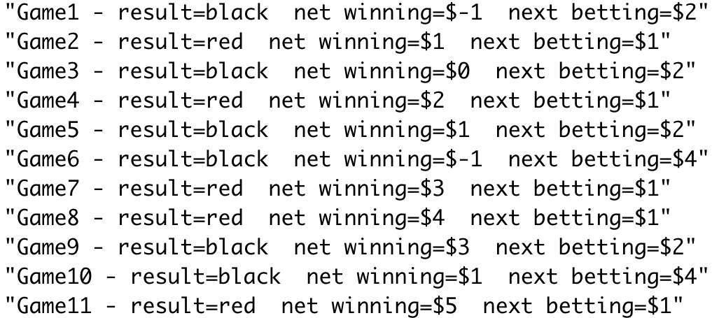

Homework is not collected.  The quiz based on this homework will be at the beginning of class, Sep 7.

You do not need to write any code for this homework.  You only need to *describe* how you would perform the simulations and analyze the results.

Read Section 1.1, “Simulation of Discrete Probabilities,” in *Introduction to Probability* (pages 1-12). Do not worry about the programs mentioned in the reading. We will run some of the simulations in R, or another programming language, later.

## Question 1

Let $X$ be the number of heads in three coin tosses. The coins are assumed to be fair.

1. What is the probability mass function of $X$?
2. Verify that this probability mass function satisfies the two conditions.

Show solution

The probabilities can be calculated by listing all $2^3 = 8$ outcomes:

$$
P(X = 0) = 0.125, \quad P(X = 1) = 0.375, \quad P(X = 2) = 0.375, \quad P(X = 3) = 0.125.
$$

All probabilities are nonnegative, and they add up to 1.

## Question 2

Suppose you roll three fair dice and calculate the sum of the three rolls. Is the sum more likely to be 9 or 10? You can simulate the result of three dice rolls on [random.org/dice](https://www.random.org/dice/){target="_blank"} for a few times to get a sense. Use the four steps discussed in the lecture to describe how to estimate the probability that the sum is 9 and the probability that the sum is 10.

Show solution

- **One simulation:** Roll three fair dice; an example outcome is $(3, 5, 3)$.
- **What to record:** Record the sum of the three dice rolls (e.g., $3 + 5 + 3 = 11$).
- **Repeat many times:** The results might look like $11, 10, 5, 9, 9, \ldots$.
- **Summarize the results:** Compare the proportion of 9s with the proportion of 10s.

## Question 3

Consider Question 10 on page 14 of *Introduction to Probability*:

> Another well-known gambling system is the martingale doubling system. Suppose that you are betting on red to turn up in roulette. Every time you win, bet 1 dollar next time. Every time you lose, double your previous bet. Suppose that you use this system until you have won at least 5 dollars or you have lost more than 100 dollars. Write a program to simulate this and play it a number of times and see how you do. In his book *The Newcomes*, W. M. Thackeray remarks, “You have not played as yet? Do not do so; above all avoid a martingale if you do.” Was this good advice?

In roulette, the probability of red is $18/38$. Are you more likely to win 5 dollars or to lose 100 dollars? Use the four steps to describe how to estimate the probability of winning 5 dollars and the probability of losing 100 dollars.

Show solution

- **One simulation:** Initialize the net winnings with $X^0 = 0$ and the current bet with $b^0 = 1$. Randomly sample a roulette outcome: red with probability $18/38$ and black with probability $20/38$. If the outcome is red, set $X^{i+1} = X^i + b^i$ and $b^{i+1} = 1$. If the outcome is black, set $X^{i+1} = X^i - b^i$ and $b^{i+1} = 2b^i$. Stop when $X^i \ge 5$ or $X^i \le -100$.
- **What to record:** Record the net winnings when the game stops, and optionally record the game length.
- **Repeat many times:** The results might look like $5, 5, 5, -124, 5, \ldots$.
- **Summarize the results:** Compare the proportion of results that are 5 or above with the proportion that are -100 or below.

{width=60%}

## Question 4

Use the four steps to design a simulation to answer Question 13 on page 14 of *Introduction to Probability*:

> The psychologist Tversky and his colleagues say that about four out of five people will answer (a) to the following question:
>
> A certain town is served by two hospitals. In the larger hospital about 45 babies are born each day, and in the smaller hospital 15 babies are born each day. Although the overall proportion of boys is about 50 percent, the actual proportion at either hospital may be more or less than 50 percent on any day. At the end of a year, which hospital will have the greater number of days on which more than 60 percent of the babies born were boys?
>
> (a) the large hospital  
> (b) the small hospital  
> (c) neither: the number of days will be about the same.
>
> Assume that the probability that a baby is a boy is 0.5. Decide, by simulation, what the right answer is and suggest why so many people go wrong.

Show solution

The large hospital can be simulated as follows:

- **One simulation:** For one day, generate 45 independent outcomes, each equal to 0 for a girl or 1 for a boy, with probability 0.5. Calculate the proportion of boys (e.g., $20/45$). Repeat this for 365 days for one simulated year: $20/45 (day 1), 18/45 (day 2), 23/45 (day 3), \ldots$.
- **What to record:** Record the number of days, out of 365, on which more than 60% of the babies were boys.
- **Repeat many times:** The results might look like $180, 185, 168, \ldots$.
- **Summarize the results:** Repeat the same simulation for the small hospital, using 15 births per day. Compare the average/median numbers of "boy days," or compare their distributions with histograms.

