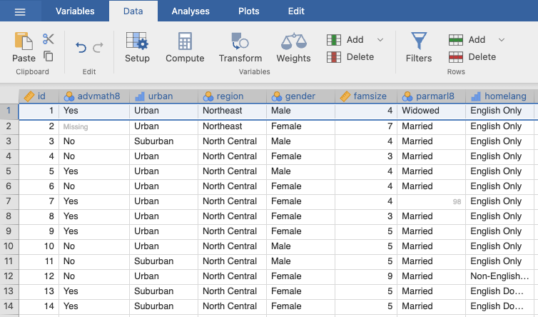
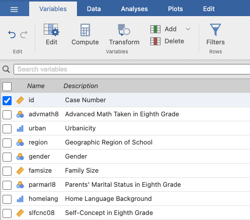
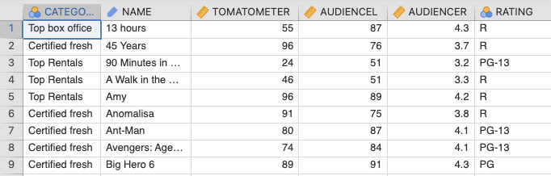
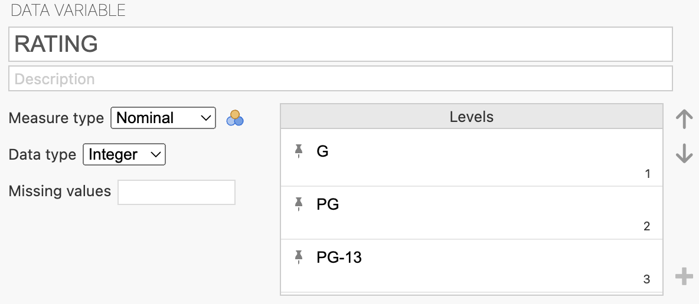
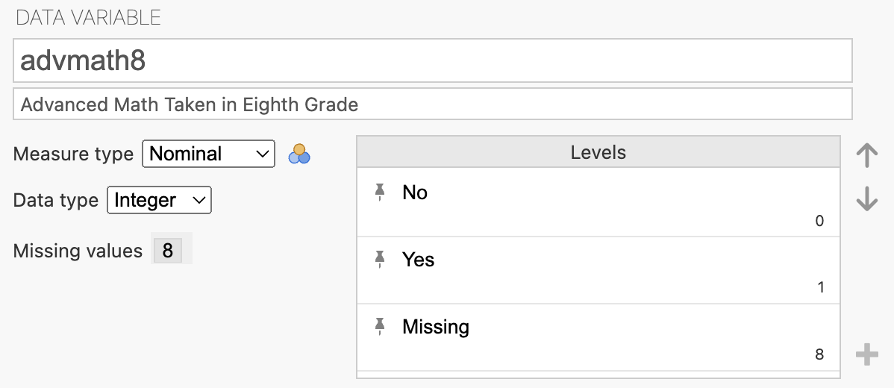

::: {style="position: absolute; bottom: 0; font-size: 0.5em; color: #888;"}
Narrative Summary on selective slides are optional. They are drafted by AI based on annotated lecture slides from previous semesters. They are fully proofread and verified by the instructor.
:::

## Data format

For any (tabular) dataset, the first step is to look at:

  1. What are the **subjects**?
  2. What are the **variables** for the subjects?

Lecture notes

* What are the subjects? $\rightarrow$ Look at the **rows** (student, in this case)
* What are the variables? $\rightarrow$ Look at the **columns** (e.g., id, advmath8, urban, etc.)
* In the following screenshots, top table is the **data view** in Jamovi; bottom table is the **variable view**.

Example (**NELS.sav**)

Another example (**Combined Class Movies.sav**)

Lecture notes

* Subjects $\rightarrow$ row (movie)
* Variables $\rightarrow$ column (Category, Name, Rating, etc.)

Show Narrative Summary

Every dataset should be organized as a rectangular table: rows and columns. To familiarize yourself with a new dataset, first ask, "what does each row/column represent?"

In the **NELS** data, each **row** is a student (a *subject*), and each **column** is a piece of information recorded about that student (a *variable*), such as `id`, whether the student took advanced math in 8th grade (`advmath8`), the urbanicity of their school (`urban`), their geographic `region`, `gender`, and family size (`famsize`).

In the **Combined Class Movies** data, each **row** is a movie (a *subject*), and each **column** is a piece of information recorded about that movie (a *variable*), such as `Category`, `Name`, `Rating`, etc.

Jamovi provides two different display windows: The **Data View** looks like a spreadsheet of the actual data. The **Variable View** is a separate table listing all the variables and their descriptions.

As an example, the **NELS** data contains information for 500 students, with 48 variables recorded for each student.  Hence, the data view shows 500 rows and 48 columns, and the variable view shows a list of 48 variables.

## Variables

A variable can have different **values**:

* **Subject ID:** 1, 2, 3, 4, …
* **Age:** 12, 13, 14, 15
* **Rating:** NC-17, R, PG-13, PG, G
* **Whether or not the student has taken advanced math in 8th grade (advmath8):** Yes, No

For the ease of analysis, non-numeric values are typically given a numeric coding

Show Narrative Summary

Variables can have different values (i.e., they "vary"): `Northeast` is NOT a variable; `region` is a variable.  

Importantly, variables can take on very different *kinds* of values — some are simple counts or IDs (Subject ID, Age), some are ordered categories (movie `RATING`), and some are yes/no responses (took advanced math in 8th grade). 

To make these values easier to store and analyze in software, they are frequently **recoded into numbers**. For example, the categorical MPAA ratings G/PG/PG-13/R/Other become 1–5, and the yes/no advanced-math question becomes 0/1, with a special code like 8 reserved to represent missing responses. It is important to remember that these numeric codes are just labels — the number itself is often arbitrary, and whether the *order* of the numbers is meaningful depends on the variable.

## Measure type of a variable

Variables can have different **types**, based on the property of their values. The type of a variable is also referred to as its **measure type** or **level of measurement**.  There are three main types:

1. **Nominal**

2. **Ordinal**

3. **Continuous (or Scale, or Numeric)**

Lecture notes

- Nominal: categorical, order does **not** matter (e.g., region: North, South, East, West)

- Ordinal: categorical, order **does** matter (e.g., GPA: ≥ 3.5, 2.5–3.5, ≤ 2.5)

- Continuous: numeric values (e.g., actual GPA values)

Show Narrative Summary

We always need to consider the measure type of a variable before choosing the appropriate statistical analysis.

* A **nominal** variable is categorical, and the categories have no natural order — e.g., geographic `region` (North, South, East, West). It would not make sense to say one region is "more" or "less" than another.
* An **ordinal** variable is also categorical, but its categories *can* be ranked — e.g., GPA collapsed into bins such as "≥ 3.5", "2.5–3.5", and "≤ 2.5." Here, the ordering of the bins carries meaning even though we've lost the exact numeric value.
* A **continuous** variable is a genuine numeric measurement, such as an exact GPA value (e.g., 3.2). Arithmetic differences are meaningful (a GPA of 4.0 is exactly 0.5 higher than 3.5).  A **continuous** variable is also called a **scale** variable, or a **numeric** variable.

## Measure type: examples

Determine the measure type for each variable below.

1. **Family Size (`famsize`); no coding**
2. **School Type in Eighth Grade (`schtyp8`)** (1 = "Public", 2 = "Private, Religious", 3 = "Private, Non-Religious")
3. **Number of times you missed school in 12th grade; no coding**
4. **Number of times you missed school in 12th grade (`absent12`)** (0 = "Never", 1 = "1-2 Times", 2 = "3-6 Times", 3 = "7-9 Times", 4 = "10-15 Times", 5 = "Over 15 Times")
5. **Math achievement in 10th grade (`achmat10`); no coding**
6. **Computer owned by family in 8th grade (`computer`)** (0 = "No", 1 = "Yes")
7. **My teachers are interested in students (`tcherint`)** (1 = "Strongly Agree", 2 = "Agree", 3 = "Disagree", 4 = "Strongly Disagree")
8. **Zip code; no coding**
9. **Year a movie is released; no coding**
10. **Highest level of education expected (`edexpect`)** (1 = "Less than College Degree", 2 = "Bachelor's Degree", 3 = "Master's Degree", 4 = "Ph.D., MD, JD, etc.")
11. **Socio-Economic Status (`SES`); no coding**
12. **Urbanicity (`urban`)** (1 = "Urban", 2 = "Suburban", 3 = "Rural")

Show answer

1. **Family Size** → Continuous
2. **School Type** → Nominal
3. **Number of times missed school (no coding)** → Continuous
4. **Number of times missed school (coded)** → Ordinal
5. **Math achievement** → Continuous
6. **Computer owned** → Dichotomous

A **dichotomous variable** is one with only two possible categories or values (e.g., "yes/no;" "domestic/international").  This is not an option in Jamovi explicitly; it is typically labeled as nominal.

7. **Teacher interest** → (Likert) scale; Continuous

A **Likert Scale** variable represents levels of agreement or feelings about something (e.g., Strongly Agree → Strongly Disagree); you should treat it as a **continuous** variable.

8. **Zip code** → Nominal
9. **Year released** → Continuous
10. **Education expected** → Ordinal
11. **Socio-Economic Status** → Continuous
12. **Urbanicity** → Nominal or Ordinal; *can be interpreted either way*

There is some subjectivity in assigning measure types: Urban/Suburban/Rural could be seen as unordered categories (nominal) or as ordered by the degree of urbanicity (ordinal).

## Summary

* Deciding the measurement type is very important in determining the correct method for analyzing a variable!
* The same variable can have different measurement types (e.g., salary in USD vs. salary as 1 = "< 40k", 2 = "40k to 100k", 3 = "> 100k").
* **Likert scale** variables are usually treated as scale/continuous variables.
* **Dichotomous** variables are special in many cases; Jamovi does not have a separate category for them and usually labels them nominal.  Judge for yourself!
* **Measurement type** in Jamovi (or most other software) is not always set correctly.  This is partly because classifying measurement type often requires judgment, not just a mechanical rule.
