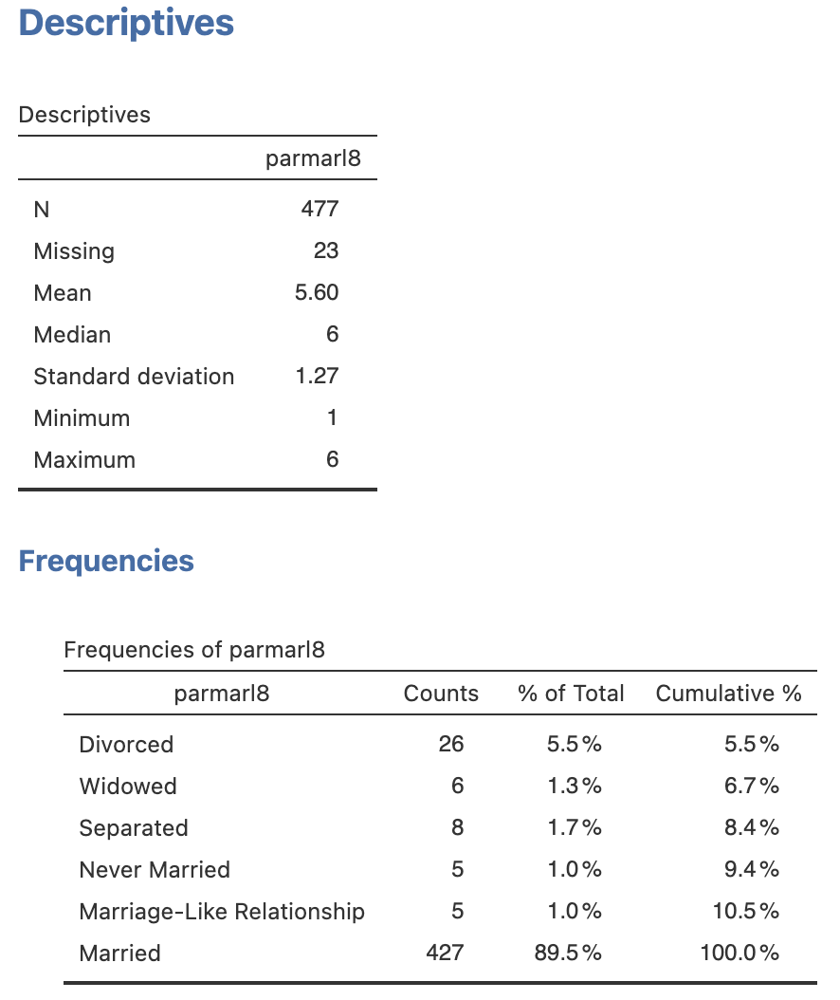
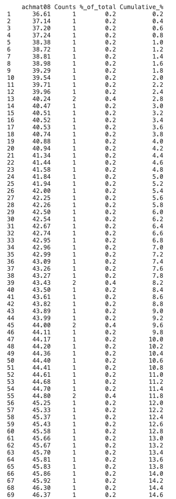
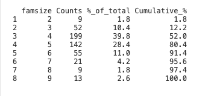
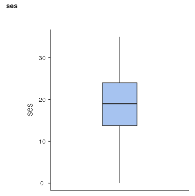
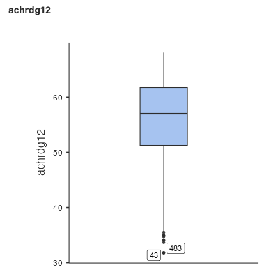
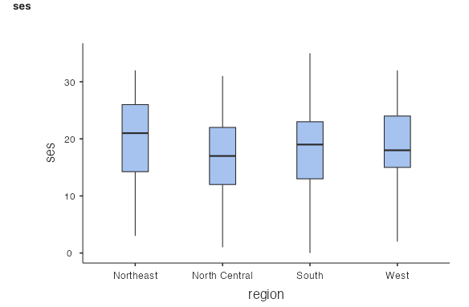
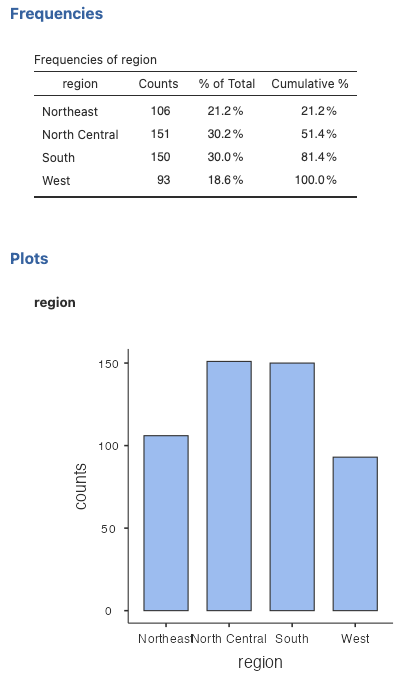
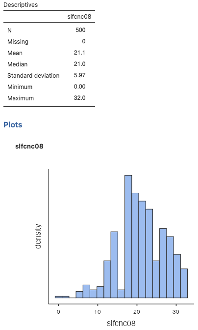
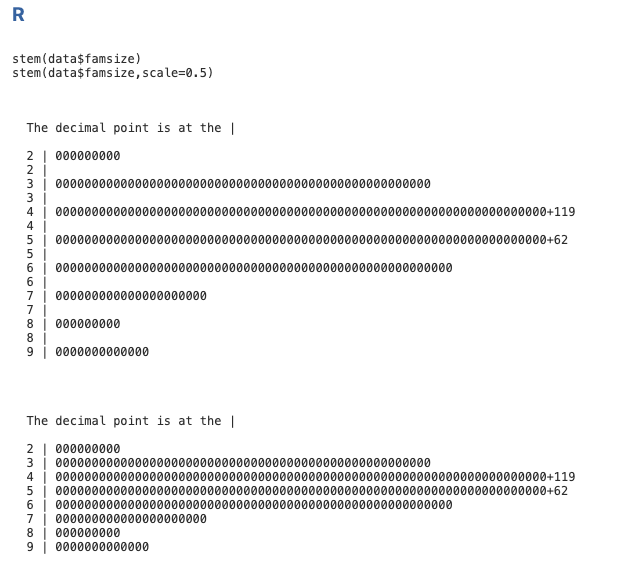
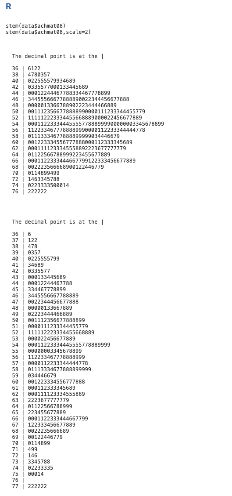

::: {style="position: absolute; bottom: 0; font-size: 0.5em; color: #888;"}
Some narrative text in *Lecture notes and summary* are drafted by AI.  They are fully proofread and verified by the instructor.
:::


## Introduction

- **Univariate** distribution: describe ONE variable

- Usually, a **combination of tools** can be used (e.g., statistics, table, visualizations)

- The **same information** about a variable can be given by **different tools**

- Choice of tools largely depends on the measurement type 


<hr>

<details>
<summary>Lecture notes and summary</summary>

A univariate distribution describes one variable at a time. Choose a combination of numerical summaries, tables, and graphs according to the variable's level of measurement.

</details>

## Frequency table - categorical variable
<details>
<summary>Lecture notes and summary</summary>

For the variable `parmarl8` (Parents' Marital Status in 8th grade):

* **% of Total** example: $5.5\% = 26 / 477$

* **Cumulative %** example:  $8.4\%$ for "Separated" = $5.5\% + 1.3\% + 1.7\%$ (i.e., it is the sum of all percents up to that row)

* Cumulative percent is NOT very useful in this case as it is a **nominal** variable

* Should pay attention to how missing values are handled: in this case, by default, they are excluded from the percentage calculations
</details>




## Frequency table - continuous variable
<details>
<summary>Lecture notes and summary</summary>

For the variable `achmat08` (Math achievement in 8th grade):

* **% of Total** example: $0.2\% = 1 / 500$

* **Cumulative %** example 1: in row 30, a score of 42.54 has a cumulative percentage of $6.2\%$, which means that $6.2\%$ of students in the dataset scored 42.54 or lower

* **Cumulative %** example 2: if I want to identify the bottom $5\%$ of students, I would look for the row where the cumulative percentage reaches $5\%$.  The grade cutoff I'm looking for is 41.84

* Counts and "%_of_total" columns are NOT very useful in this case as it is a **continuous** variable; most values have a count of 1 (i.e., unique scores); occasionally some values would have a count of 2 or more just due to coincidence
</details>




## Percentile: intuitive examples

- [SAT](https://en.wikipedia.org/wiki/SAT) percentiles.

- [Pediatric measurement percentiles](https://www.cdc.gov/growthcharts/cdc-growth-charts.htm) (e.g., height and weight for age).

<details>
<summary>Lecture notes and summary</summary>

Percentiles compare one observation with a reference distribution. SAT reports show how a student's score compares with scores from other test takers, while pediatric growth charts compare a child's height or weight with measurements for children of the same age and sex.

</details>

## Percentile and Percentile Rank

**Kth percentile** of a variable: a value that "beats" k% of the data



* 25th percentile of family size:

* 90th percentile of family size:

**Percentile rank** of a given value: % of data that are below the given value

* Percentile rank of 4:

* Percentile rank of 8:


**Comparing percentile and percentile rank:**

* For example, after midterm 1, I can say "the 75th percentile of our class is 86." What does that mean?


* If your grade is 82, you could ask me what your percentile rank is.  If the percentile rank of 82 is 62%, what does that mean?

<details>
<summary>Lecture notes and summary</summary>

For the family-size table, the 25th percentile is 4: 25% of families have four or fewer members. The 90th percentile is 6: 90% of families have six or fewer members.

The percentile rank of 4 is 52%, meaning 52% of families have fewer than four members. The percentile rank of 8 is 97.4%, meaning 97.4% of families have fewer than eight members.

The 75th percentile of 86 means that 75% of the class scored 86 or lower, and 25% scored above 86. A percentile identifies a score at a particular position in a distribution.

A percentile rank of 62% for a score of 82 means that 62% of class scores are below 82. A percentile rank identifies the percentage of observations below a given score.

</details>


## Five Number Summary and IQR

**Five Number Summary** provides a quick snapshot of a continuous distribution:

* **Minimum** (min):
* **First Quartile (Q1)**:
* **Second Quartile (Q2)**:
* **Third Quartile (Q3)**:
* **Maximum** (max):

**Interquartile Range (IQR)**


<details>
<summary>Lecture notes and summary</summary>
* Minimum: smallest observed value
* $Q_1$: 25th percentile
* $Q_2$: median, or 50th percentile
* $Q_3$: 75th percentile
* Maximum: largest observed value
* $IQR = Q_3 - Q_1$

* Quartiles divide the data into four equal parts
* The IQR (middle 50%) is often more robust than the full range for describing spread
* IQR covers the middle 50% of the data
* Range = max − min (covers all data)

The five-number summary provides the distribution's extremes, center, and middle spread. The IQR is less influenced by unusually high or low values than the full range.
</details>

---


## Boxplot

A boxplot is a visualization of the five number summary.  In other words, it is made ONLY based on the minimum, Q1, median (Q2), Q3, and maximum.


::: columns
:::: column

::::

:::: column

::::

:::: column

::::
:::

<details>
<summary>Lecture notes and summary</summary>
* **Box**: extends from Q1 to Q3, with a line at Q2 (median)
* **Whiskers**: extend from Q1 down to the minimum, and from Q3 up to the maximum
* **Points**: individual outliers (extreme values)


Boxplots are useful for:
* Comparing distributions of a scale variable across groups
* Example: Math Achievement by Geographic Region of School
* The scale variable goes on the y-axis; the grouping variable (factor) goes on the x-axis
* All boxes should not be in the same scale—each region may have a different distribution

A boxplot uses only the five-number summary. Side-by-side boxplots make it easier to compare the centers, spreads, and possible outliers of groups.
</details>


## Bar Graph

Used for **nominal/ordinal variables**



<details>
<summary>Lecture notes and summary</summary>
* **Bar graph**: X-axis (categories) is not necessarily ordered
* **Width of bar**: does not matter (unlike histograms)

Pie charts and bar graphs both visualize the distribution of categorical data. The pie chart shows each category as a slice, with the slice size proportional to its frequency or percentage. Bar graphs show categories on the x-axis and frequency on the y-axis.

A key distinction: in a bar graph for a nominal variable (like geographic region), the order of categories is arbitrary—you could rearrange them without changing the meaning. The width of each bar is just a visual feature; what matters is the height (frequency). This is different from histograms, where bar width represents a meaningful range of numeric values.

</details>

## Histogram

Used for **scale variables**



<details>
<summary>Lecture notes and summary</summary>

* **X-axis**: ordered numeric values (e.g., math achievement)
* **Y-axis**: frequency
* **Bar width**: represents the **range** of values in each bin
* Mean = 56.99, Std. Dev. = 7.836, N = 500
* X-axis is ordered; width of bar represents the range
* Reveals the **shape** of the distribution (e.g., roughly symmetric, bell-shaped)

A histogram is designed for numeric data. Its connected bars represent ordered intervals, allowing us to see the distribution's overall shape, including its center, spread, skewness, and number of peaks.

</details>

## Stem-and-Leaf

Let's first take a look at [A Japanese train timetable](Stem%20and%20leaf.pdf) from 1985 (from [*Envisioning Information*](https://www.edwardtufte.com/book/envisioning-information/), Tufte)

A basic example:

```{r,echo=F}
mydata <- c(13,13,13,14,16,17,17,23,48,49,55,55,55,60,61,61,62,63,64,68)
cat("data:", mydata)
stem(mydata, scale=2)
```

<details>
<summary>Lecture notes and summary</summary>

With `scale = 2`, the stems represent intervals of 10: stem 1 represents values from 10 to 19, stem 2 represents values from 20 to 29, and so forth. Each leaf represents the ones digit of an observation.

</details>


## Stem-and-Leaf

Stem-and-leaf plots are not very precise, and different software may use different rounding or grouping strategies, which can affect the appearance of the plot.

<details>
<summary>Family size</summary>


</details>


<details>
<summary>Math achievement in 8th grade</summary>



</details>


<details>
<summary>Lecture notes and summary</summary>

In a stem-and-leaf plot, the stem gives the leading digit(s) and each leaf represents a remaining digit. It displays the distribution's shape while retaining individual observations, but grouping, rounding, and repeated leaves can make the original values difficult to recover exactly.

</details>