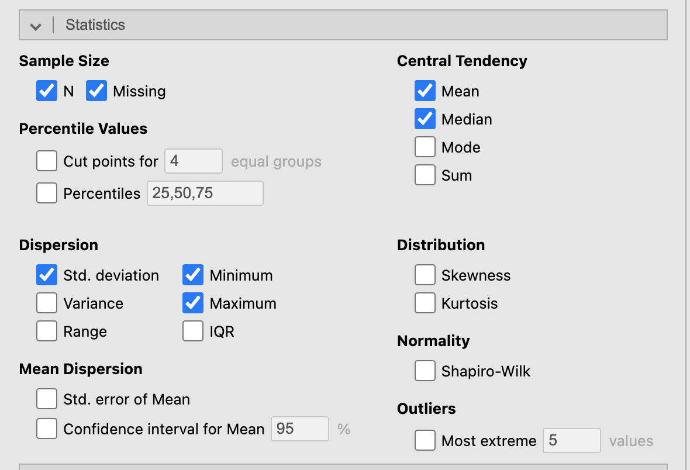

## Overview

In Chapter 2, we learned a few tools to examine univariate *distributions*.  For any distribution, what properties are we looking at exactly?

<details>
<summary>R code (optional)</summary>
```r
library(Lock5Data)
library(tidyverse)

NBAPlayers2024 %>%
  filter(FGAttempt > 50, Pos %in% c("C", "PG", "SF")) %>%
  ggplot(aes(x = Pos, y = FGPct, fill = Pos)) +
  geom_boxplot() +
  labs(title = "Field Goal % by Position (NBA 2023-24)",
       x = "Position", 
       y = "Field Goal Percentage") +
  theme_minimal()

NBAPlayers2024 %>%
  filter(FGAttempt > 50, Pos %in% c("C", "PG", "SF")) %>%
  ggplot(aes(x = FGPct, fill = Pos)) +
  geom_histogram(binwidth = 0.02, color = "white") +
  facet_wrap(~ Pos, ncol = 3) +
  labs(title = "Field Goal % by Position (NBA 2023-24)",
       x = "Field Goal Percentage", 
       y = "Count") +
  theme_minimal()
```
</details>

```{r echo=FALSE}
library(Lock5Data)
library(tidyverse)

NBAPlayers2024 %>%
  filter(FGAttempt > 50, Pos %in% c("C", "PG", "SF")) %>%
  ggplot(aes(x = Pos, y = FGPct, fill = Pos)) +
  geom_boxplot() +
  labs(title = "Field Goal % by Position (NBA 2023-24)",
       x = "Position", 
       y = "Field Goal Percentage") +
  theme_minimal()

NBAPlayers2024 %>%
  filter(FGAttempt > 50, Pos %in% c("C", "PG", "SF")) %>%
  ggplot(aes(x = FGPct, fill = Pos)) +
  geom_histogram(binwidth = 0.02, color = "white") +
  facet_wrap(~ Pos, ncol = 3) +
  labs(title = "Field Goal % by Position (NBA 2023-24)",
       x = "Field Goal Percentage", 
       y = "Count") +
  theme_minimal()
```

<details>
<summary>Lecture notes and summary</summary>
This example previews the three properties studied in this chapter: **location** (where is FG% centered for each position?), **spread** (how much does FG% vary within each position?), and **shape** (is the distribution symmetric or skewed?). We see that Centers typically have higher field goal percentages (measure of location), but their percentages are more variable (measure of spread) and the distribution appears slightly right-skewed (measure of shape). Point guards have lower field goal percentages, on average, but their percentages are more consistent and the distribution is roughly symmetric.
</details>


## Numeric summaries of data {.nostretch}

In addition to visualizations, we can use **numeric summaries** of data to describe a distribution.  

A numeric summary of data is called a “statistic,” i.e., the sample mean is a statistic; the sample maximum is a statistic, etc.

{width=180%}

Common statistics can be grouped by what they measure:

(1) Location (central tendency): mean, median, mode, percentiles (esp. Q1, Q2, Q3)
(2) Spread (dispersion): range, interquartile range (IQR), standard deviation (SD), variance
(3) Shape of distribution: skewness ratio

<details>
<summary>Lecture notes and summary</summary>
These three categories of statistics (location, spread, shape) organize the rest of the chapter.
</details>


# Location (central tendency)

## mean, median, and mode

Example: How many hours did you sleep?

- Mean:

- Median:

- Mode:

Example: type of recipe (1=Appetizer, 2=Main course, 3=Dessert, 4=Other). Can we calculate mean?  Median?  Mode?

Example: average preparation time (1=0 to 30 min, 2=30 min to 1 hour, 3=1 hour to 2 hours, 4 = 2 hours and above). Can we calculate mean?  Median?  Mode?

Recall, **Likert scale variables** are treated like numeric variables and people frequently calculate the mean for Likert scale variables.

<details>
<summary>Lecture notes and summary</summary>
How many hours did you sleep? Sleep hours is a **continuous** variable, so mean, median, and mode can all be calculated.

As an example, let's say the data is 7, 8, 6, 5, 7, 9, 7. The mean is (7+8+6+5+7+9+7)/7 = 49/7 = 7 hours. The median is the middle value when sorted: 5, 6, 7, 7, 7, 8, 9 → median = 7 hours. The mode is the most frequent value: mode = 7 hours.

Type of recipe (1=Appetizer, 2=Main course, 3=Dessert, 4=Other) is a **nominal** variable — the numeric codes are arbitrary labels with no order. Only the **mode** (the most common category) is meaningful; mean and median should not be calculated.

Average preparation time (1=0-30 min, ..., 4=2+ hours) is an **ordinal** variable — the categories are ordered, so **median** and **mode** are meaningful, but the **mean** should generally be avoided.

Likert scale items are technically ordinal, but by common (if debated) convention they are often treated as scale/continuous variables, and the mean is frequently reported.
</details>


## Example: choosing appropriate statistics

Provide an interpretation for the statistics in the table below.  Pay attention to what statistics should not be interpretated. 


```{r echo=FALSE}
library(haven)
library(jmv)
library(tidyverse)
mydata <- read_sav("../../../../dataset/NELS.sav")
cat("famsize:\n")
attr(mydata$famsize, "labels")
cat("region:\n")
attr(mydata$region, "labels")
cat("hwkin12:\n")
attr(mydata$hwkin12, "labels")
```


: Descriptives

|                    | famsize | region | hwkin12 |
|:-------------------|--------:|-------:|--------:|
| N                  |  500.00 | 500.00 |  497.00 |
| Missing            |    0.00 |   0.00 |    3.00 |
| Mean               |    4.69 |   2.46 |    3.43 |
| Median             |    4.00 |   2.00 |    3.00 |
| Standard deviation |    1.32 |   1.02 |    1.97 |
| Minimum            |    2.00 |   1.00 |    0.00 |
| Maximum            |    9.00 |   4.00 |    8.00 |

<details>
<summary>R code (optional)</summary>
```r
library(haven)
library(jmv)
library(tidyverse)
mydata <- read_sav("../../../../dataset/NELS.sav")
cat("famsize:\n")
attr(mydata$famsize, "labels")
cat("region:\n")
attr(mydata$region, "labels")
cat("hwkin12:\n")
attr(mydata$hwkin12, "labels")
```
</details>

<details>
<summary>Jamovi procedure</summary>
Exploration -> Descriptives (statistics can be selected under `Statistics`)
</details>

<details>
<summary>Lecture notes and summary</summary>
**Famsize** (number of people in the family) is a **continuous** variable, so both the mean (4.69) and median (4.00) are meaningful: a typical family in the sample has about 4 to 4.7 members.

**Region** (1=Northeast, 2=North Central, 3=South, 4=West) is a **nominal** variable — the numeric codes are arbitrary labels. The mean (2.46) and median (2.00) should **not** be interpreted as a "typical region;" only the mode (the most common region) would be meaningful. In this case, the most common region is 2 (North Central). Avoid saying that "most people" are in the North Central region, which implies more than 50% of the data and is not necessarily true.

**Hwkin12** (weekly homework hours, coded 0=None up to 8=Over 20 hours) is an **ordinal** variable. The median (3.00, corresponding to the "4-6 hours" category) is the appropriate measure of a typical value; the mean (3.43) should not be used.
</details>


# Spread (dispersion)

## standard deviation (SD), range and interquartile range (IQR)

Example 1: The following two classes both have an average of 77. Are their performances similar? How would you characterize their differences?

```{r echo=TRUE}
class1 <- c(35, 61, 62, 68, 80, 82, 92, 95, 95, 99)
class2 <- c(70, 70, 72, 75, 76, 77, 79, 81, 82, 88)
sd(class1);var(class1);IQR(class1)
sd(class2);var(class2);IQR(class2)
```

- **standard deviation** measures the average distance of each data point from the mean (**variance** is the square of the standard deviation)

- **interquartile range (IQR)** measures the range within which the middle 50% of the data lie; **range** measures the difference between the maximum and minimum values


Example 2: San Francisco and Washington D.C. has the [same annual average temperature](https://en.wikipedia.org/wiki/List_of_cities_by_temperature) of 14.6C/58.2F, however, their temperature distributions throughout the year are quite different.


Example 3: [Eruption predictions of the geysers at Yellowstone National Park](https://www.nps.gov/yell/planyourvisit/exploreoldfaithful.htm); the Old faithful geyser is famously predictable due to **consistent** historical waiting times. 

<details>
<summary>Lecture notes and summary</summary>
Although both classes average 77, Class 1 has SD = 20.32 (variance = 412.99, IQR = 30.75, range = 64) while Class 2 has SD = 5.72 (variance = 32.67, IQR = 7.75, range = 18). Class 1's scores are far more spread out — some students scored very low (35) and some very high (99) — while Class 2's scores are tightly clustered around 77. So despite the identical average, the two classes performed very differently: Class 1 is much less consistent, or more homogeneous, than Class 2.  We can say that Class 2 has more variation, is more diverse, or is more heterogeneous, than Class 1.

San Francisco and Washington D.C. share the same annual average temperature, but San Francisco's temperature is far more **consistent** year-round (small SD), while D.C. has hot summers and cold winters (large SD) — the same mean can hide very different spreads.

Old Faithful's waiting times between eruptions have a small SD/consistent pattern, which is exactly why predictions of the next eruption are reliable.
</details>


## Example: writing a thorough statistical interpretation

A thorough statistical interpretation should include:

1) name(s) of relevant statistic(s);

2) values(s) of relevant statistics;

3) an interpretation **in context**;

4) a description of **who/what** the conclusion is valid for;

5) if applicable, a note on any other supporting or contradictory statistics.

Example: what’s a *typical* math achievement score?  Also, as a review, explain how the range and IQR values are calculated.

<details>
<summary>R code (optional)</summary>
```r
library(jmv)
library(haven)
mydata <- read_sav("../../../../dataset/NELS.sav")
options(digits = 4)
jmv::descriptives(
  data = mydata,
  vars = "achmat08",
  mode = T,
  iqr = T,
  range = T,
  min = T,
  max = T,
  pcEqGr = T
)

```
</details>

```{r echo=FALSE}
library(jmv)
library(haven)
mydata <- read_sav("../../../../dataset/NELS.sav")
options(digits = 4)
jmv::descriptives(
  data = mydata,
  vars = "achmat08",
  mode = T,
  iqr = T,
  range = T,
  min = T,
  max = T,
  pcEqGr = T
)
```

<details>
<summary>Lecture notes and summary</summary>
For students in the NELS dataset, a typical math achievement score is about 56 (median=56.18, mean=56.59).

Range = maximum − minimum = 77.20 − 36.61 = 40.59. IQR = 75th percentile − 25th percentile = 63.74 − 49.43 = 14.31. The IQR is much smaller than the range because it excludes the most extreme 25% of scores on each end, so it is less affected by any unusually high or low scorers.
</details>


# Skewness and shape of distribution 

## Tail values and skewness {.nostretch} 

Example: suppose these are histograms of exam grades for three classes.  How are the three classes different?

<details>
<summary>R code (optional)</summary>
```r
set.seed(1)
n <- 1000

symmetric    <- rnorm(n, mean = 70, sd = 5)
left_skewed  <- rbeta(n, shape1 = 20, shape2 = 2) * 100
left_skewed  <- left_skewed - mean(left_skewed) + 70
right_skewed <- rbeta(n, shape1 = 2, shape2 = 20) * 100
right_skewed <- right_skewed - mean(right_skewed) + 70

par(mfrow = c(1, 3))
hist(symmetric, col = "lightblue", breaks = 30, main=NA, xlab=NA, ylab=NA)
hist(left_skewed, col = "lightgreen", breaks = 30, main=NA, xlab=NA, ylab=NA)
hist(right_skewed, col = "lightcoral", breaks = 30, main=NA, xlab=NA, ylab=NA)
```
</details>

```{r echo=FALSE, out.width="120%"}
set.seed(1)
n <- 1000

symmetric    <- rnorm(n, mean = 70, sd = 5)
left_skewed  <- rbeta(n, shape1 = 20, shape2 = 2) * 100
left_skewed  <- left_skewed - mean(left_skewed) + 70
right_skewed <- rbeta(n, shape1 = 2, shape2 = 20) * 100
right_skewed <- right_skewed - mean(right_skewed) + 70

par(mfrow = c(1, 3))
hist(symmetric, col = "lightblue", breaks = 30, main=NA, xlab=NA, ylab=NA)
hist(left_skewed, col = "lightgreen", breaks = 30, main=NA, xlab=NA, ylab=NA)
hist(right_skewed, col = "lightcoral", breaks = 30, main=NA, xlab=NA, ylab=NA)
```


- Symmetric

- Tail values

- Left skewed or negative skewed

- Right skewed or positive skewed

<details>
<summary>Lecture notes and summary</summary>
**Symmetric**: the left and right halves of the distribution mirror each other; mean ≈ median.

**Tail values**: the thinner, more spread-out side of a distribution; they represent low frequency, extreme values.

**Left skewed (negative skew)**: the tail is on the left (histogram in the middle)

**Right skewed (positive skew)**: the tail is on the right (histogram on the right)
</details>


## Outliers {.nostretch}

We can similarly tell skewness from boxplots

<details>
<summary>R code (optional)</summary>
```r
par(mfrow = c(1, 3))
boxplot(symmetric, col = "lightblue", main=NA, xlab=NA, ylab=NA)
boxplot(left_skewed, col = "lightgreen", main=NA, xlab=NA, ylab=NA)
boxplot(right_skewed, col = "lightcoral", main=NA, xlab=NA, ylab=NA)
```
</details>

```{r echo=FALSE, out.width="120%"}
par(mfrow = c(1, 3))
boxplot(symmetric, col = "lightblue", main=NA, xlab=NA, ylab=NA)
boxplot(left_skewed, col = "lightgreen", main=NA, xlab=NA, ylab=NA)
boxplot(right_skewed, col = "lightcoral", main=NA, xlab=NA, ylab=NA)
```

Recall: *extremely* unusual values on the tail are called outliers.  Outliers are very useful for deciding the skewness of the distribution.

<details>
<summary>Lecture notes and summary</summary>
For a symmetric distribution, the median line sits near the center of the box and the two whiskers are roughly equal in length. For a right-skewed distribution, the upper whisker is longer (and/or more outliers appear above the box). For a left-skewed distribution, the lower whisker is longer (and/or more outliers appear below the box).

If the outliers are small values (left tail), the distribution is left-skewed. If the outliers are large values (right tail), the distribution is right-skewed.
</details>

## Skewness ratio

Instead of histograms and boxplots, we can also use a statistic called the **skewness ratio**.

<details>
<summary>R code (optional)</summary>
```r
library(jmv)
library(haven)
mydata <- read_sav("../../../../dataset/NELS.sav")
options(digits = 4)
jmv::descriptives(
  data = mydata,
  vars = "achmat08",
  skew = T
)
```
</details>

```{r echo=FALSE}
library(jmv)
library(haven)
mydata <- read_sav("../../../../dataset/NELS.sav")
options(digits = 4)
jmv::descriptives(
  data = mydata,
  vars = "achmat08",
  skew = T
)
```

<details>
<summary>Jamovi procedure</summary>
Exploration -> Descriptives (check `Skewness` under `Statistics` - `Distribution`)
</details>

Skewness ratio formula: 


Direction of the skewness:


Severity of the skewness:

<details>
<summary>Lecture notes and summary</summary>
**Skewness ratio formula**: skewness ratio = skewness ÷ standard error of skewness.

**Direction**: a positive skewness value indicates right (positive) skew; a negative value indicates left (negative) skew.

**Severity**: as a rule of thumb, a skewness ratio with absolute value less than about 2 indicates a roughly symmetric distribution; a value greater than 2 indicates severe right skew and a value less than -2 indicates severe left skew.  The larger the absolute value, the more skewed the distribution.

For `achmat08`: skewness = 0.114, SE of skewness = 0.109, so the skewness ratio ≈ 0.114 / 0.109 ≈ 1.04. Since |1.04| < 2, `achmat08` is considered roughly symmetric (only very slightly right skewed).
</details>


<!--

## Additional topics from Chapter 3

Boxplots are only based on five numbers

Should not solely rely on boxplots to determine the shape of a distribution

## 1. Limitations of boxplots

Boxplots are *only based on five numbers*

Should not solely rely on boxplots to determine the shape of a distribution

## 2. Summary statistics for dichotomous variables

Example: Do you own a cat?

Yes = 1; No = 0.

Mean:

Median:

Mode:

## 3. Shape of a distribution (in addition to skewness)

Using a histogram, we can see how many “bumps” or “modes” the distribution has; Keep *outliers* in mind!

- unimodal
- bimodal
- multimodal
- uniform

At what age do women first become mothers? https://www.nytimes.com/interactive/2018/08/04/upshot/up-birth-age-gap.html

## 4. Effect of outliers

Recall, we can use outliers to determine the skewness of a distribution:

Large outliers → right skewed

Small outliers → left skewed

Effect of outliers on summary statistics:

<p># of hours slept yesterday: 5, 6, 7, 7, 7, 8, 9</p>

- Median: 7

- Mean: 7

- IQR: 2

- Range: 4

<p># of hours slept yesterday: 5, 6, 7, 7, 7, 8, 20</p>

- Median: 7

- Mean: 8.57

- IQR: 2

- Range: 15

In the previous example:

<p># of hours slept yesterday: 5, 6, 7, 7, 7, 8, 9</p>

<p># of hours slept yesterday: 5, 6, 7, 7, 7, 8, 20</p>

- Symmetric: mean ≈ median

- Right (or positive) skewed: mean >> median

- Left (or negative) skewed: mean << median

## 5. Mean vs median for scale variables

When you look for a “typical” value of a scale variable, should you use mean or median?

Example (1): What’s a typical grade for Quiz 1?

A Counterexample: Typically, how many goals are scored in a World Cup game?

Mean = 2.83

Median = 3

## 5. Mean vs median for scale variables

Example (2): How much does it typically cost to rent in Manhattan?

https://www.nytimes.com/2022/06/09/realestate/manhattan-rent-nyc.html?searchResultPosition=1

Example (3): Typically, how much money do people make?

https://www.bls.gov/oes/current/oes_nat.htm#15-0000

## 5. Mean vs median for scale variables

Example (4): Typically, how much do people make in MLM (Multi-level Marketing)?

Example (5): Typically, how long do you have to wait for the next eruption of Old Faithful?  Typically, how long does the eruption last?

https://www.reddit.com/r/antiMLM/wiki/incomedisclosures/

In these cases, mean/median are not sufficient to describe a typical value.

## Summary

Use the appropriate statistic to describe properties of a distribution

| Level of measurement of the variable | Location (average/typical value, central tendency) | Spread (variability, consistency, dispersion) | Shape (symmetric or skewed; outliers, modality) |
|---|---|---|---|
| NOMINAL | mode |  |  |
| ORDINAL | median | IQR (range) |  |
| SCALE | median (mean) | IQR (range) | skewness ratio (histogram) |

## Exercise

(Combined Class NYC Apartments dataset) We want to compare the distribution of square footage (SQFT) of NYC apartments by TYPE (coops vs condos). Explain and support your answer with the value(s) of at least one appropriate statistic.

a) Is the distribution of square footage more skewed for condos or for coops in the dataset?

Skewness ratio: Condo: 4.613 / 0.2 = 23.065; Coop: 7.803 / 0.236 = 33.178. Both are severely right skewed, but coops are more skewed.

b) Among apartments in the data set, which type of apartment typically has more square feet, condos or coops?

Median: Condo: 1150; Coop: 975. Condos typically have more square feet. Use the median instead of the mean due to extreme skewness.

c) Among apartments in the data set, which type of apartment has the more homogeneous square footage, condos or coops?

IQR: Condo: 732; Coop: 470. Coops have more homogeneous square footage. Range is affected by outliers, so should not be used.

-->