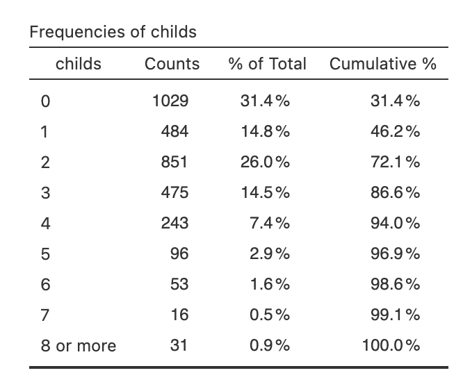
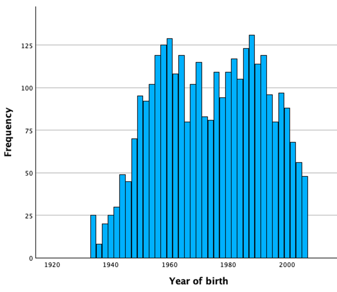
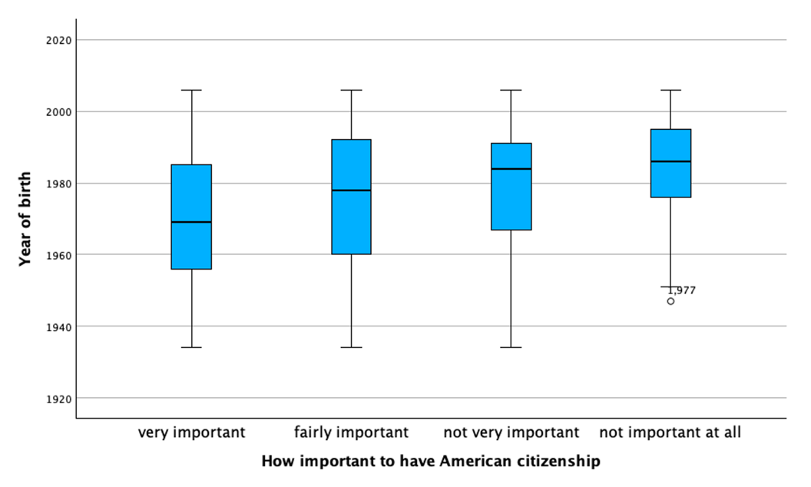
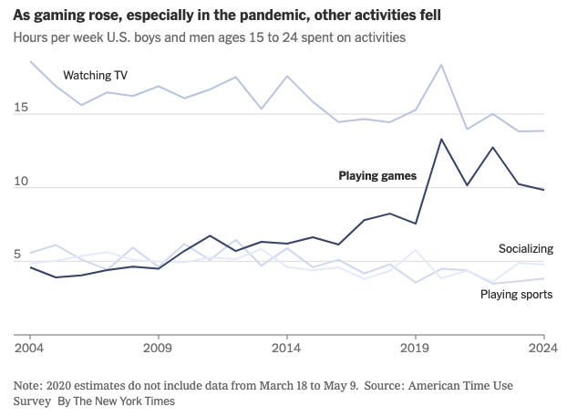

\vspace{-7em}

- Ask if you have any questions about the exam.

- Be concise in your answers. You will be penalized for adding irrelevant or incorrect information to a response.

- You don’t need to round decimals, but if you choose to, keep at least two decimals unless otherwise noted.

- You are allowed a reference sheet. Use both sides of one 8.5 by 11 inch piece of paper and put whatever you want on it. You will turn this sheet in with your exam. Be sure to put your name on it so that it can be returned to you later.

- Calculator use is permitted. You may NOT use your phone as a calculator. You will need to use your laptop, but the only programs you are allowed to have open are Jamovi and the standard Windows or Mac calculator. You need to close (not just minimize) other programs (including your web browser and all messaging apps). You are not allowed to consult any papers (other than your reference sheet), websites, books, or any person except the instructor during the exam.

- You need to download the dataset before the exam. You are not allowed to open a web browser during the exam. You must turn off WIFI on your computer.

- Cases of suspected cheating will be referred to the dean. We take cheating very seriously because it benefits student learning when students get grades that reflect what they know. For this reason, you are allowed to have at your seat only your test, your reference sheet, your computer, a calculator, and writing implements (pen or pencils). You will need to put your jacket, backpack, cell phone, smart watch and anything else you carry to class at the front of the room during the exam.

- I might tell you where to sit, or move your seat, during the exam.

- The dataset used for the exam is `GSS_SP2026.sav`. This dataset is gathered from the General Social Survey 2024, a large scale survey conducted by NORC at the University of Chicago. The levels of measurement in Jamovi are not set correctly, so you need to judge for yourself. Sometimes, the level of measurement is subjective or controversial, and the relevant question will tell you what to do.

> Note: the data is set up such that any value between -100 and -10 is automatically treated as a missing value. You don’t need to do anything about these as Jamovi knows how to handle them (for instance, they are excluded from calculations of any statistics).

\newpage
**1. (15 points)** We first examine some basic information about the dataset.

\medskip
**(a)** How many variables are recorded in the dataset? Give an example of a dichotomous variable.

\medskip
**(b)** Among respondents who answered the question, what percentage are males (sex)? You should not round and your answer should have at least one decimal place.

\medskip
**(c)** What does the variable degree represent? What is the mode of this variable? Provide an interpretation of the mode.

\newpage
**2. (25 points)** Answer the following questions about the variable childs, which represents the number of children of the respondents. Treat this variable as a NUMERIC variable.

Use the following frequency table for reference (the one in Jamovi appears in the reverse order).

{width=70%}

\medskip
**(a)** Find the respondent with id = 1. How many children does this person have, if any? Report the corresponding percentile rank. Provide an interpretation of the percentile rank in context.

\medskip
**(b)** Among respondents who answered this question, what percentage have 5 or fewer children?

\medskip
**(c)** Calculate the skewness ratio of the variable childs and draw a conclusion about the shape of the distribution based on this value.

\medskip
**(d)** Generate a boxplot for childs. You should see that there is no bottom whisker. Why? Choose one.

- (i) There is not enough number of participants in the dataset.
- (ii) The minimum and Q1 (first quartile) of this distribution are the same value.
- (iii) Boxplot should not be used for numeric variables.
- (iv) Boxplot should not be used for variables with severe skewness.

**(e)** The variable childs is actually not a numeric variable. What is the correct level of measurement? Briefly explain.

\newpage
**3. (15 points)** In this problem, we use statistics to compare the distribution of cohort (Year of birth of the respondents) between people who would continue to work and people who would stop working if they become rich (richwork).

\medskip
**(a)** Calculate the skewness ratios of cohort for people would “continue to work” and for people who would “stop working” (if they become rich). Is the distribution of cohort severely skewed for either of the groups? If so, indicate the direction of the skew. If not, briefly explain why you think the skewness is not severe.

**(b)** Typically, which group of people are older (i.e., lower value for cohort), those who would “continue to work” or those who would “stop working”? Explain and support your answer with the name(s) and value(s) of appropriate statistics. If more than one statistic is appropriate, you must use one that is robust to skewness and outliers.

**(c)** Which group are less consistent in terms of the distribution for cohort, those who would “continue to work” or those who would “stop working”? Explain and support your answer with the name(s) and value(s) of appropriate statistics. If more than one statistic is appropriate, you must use one that is robust to skewness and outliers.

\newpage
**4. (15 points)** Answer the following questions about the variable cohort (Year of birth of the respondents).

**(a)** Given below is a histogram for the variable cohort. The distribution appears to be (circle one):

uniform                 unimodal                  bimodal

Briefly explain and interpret the shape you circled in context.

**(b)** Report the mean and standard deviation values for the variable cohort.

**(c)** The survey was conducted in 2024. If someone was born in 1990, what would be the corresponding age at the time of the survey? Suppose we create a new variable, AGE, which represents the age of the participants at the time of the survey. Write down a linear transformation that calculate AGE from cohort.

**(d)** What is the mean and standard deviation of the new variable AGE (as defined in (c))? You must show your work to get full credit.

\newpage
**5. (20 points)** You do not need Jamovi for this question. Reproduced below are boxplots showing the distributions of cohort (Year of birth of the respondents) for four different groups of people based on the question “How important is it to have American citizenship?” (You do not have access to this variable).

{width=70%}

\medskip
**(a)** Estimate the median value of cohort for respondents who answered “very important.” Mark on the graph how you came up with the estimate. Provide an interpretation in context for this value.

\medskip
**(b)** For people who answered “not important at all,” is the distribution of cohort symmetric, left skewed, or right skewed? Briefly explain.

\medskip
**(c)** Which group of people are typically older (smaller value for cohort)? Which part of the boxplots did you use to answer this question? Mention the name of at least one relevant statistic.

\medskip
**(d)** Which group of people are the most homogeneous (similar) in terms of the distribution of cohort? What part of the boxplots did you use to answer this question? Mention the name of at least one relevant statistic.

\newpage
**6. (10 points)** You do not need Jamovi for this question. The following graph is from a New York Times article [“How Video Games Are Shaping a Generation of Boys, for Better and Worse.”](https://www.nytimes.com/2025/10/03/upshot/video-games-boys-young-men.html?eafs_enabled=false){target="_blank"}

{width=60%}

\medskip
**(a)** The article says that “In the last decade and a half, boys and young men ages 15 to 24 more than doubled their average time spent gaming, to about 10 hours a week, according to a major survey.” Which part of the graph support the estimate of “10 hours a week”? You can simply circle it on the graph.

\medskip
**(b)** What is a correct understanding of “10 hours a week” as quoted in (a)? Choose one.

- (i) The survey sampled one male in 2024. He is between 15 and 24 years old and spends 10 hours a week playing games.
- (ii) Among sampled males ages 15 to 24, all of them spent 10 hours a week playing games.
- (iii) Among sampled males ages 15 to 24, some spent more than 10 hours a week playing games and some spent less than 10 hours; the reported 10 hours is likely the average or median.
- (iv) Among sampled males ages 15 to 24, none of them spent more than 10 hours a week playing games.

\medskip
**(c)** The trend shown on the graph that boys and young men are spending more time playing games can be misleading without considering the shape of the distribution. What do you think is the shape of the distribution for “time spent on games per week” (Uni/bi-modal? Left/right skewed? Outliers?) Why could the trend be misleading? This is an open ended question. Provide brief discussions in the context of this question.

