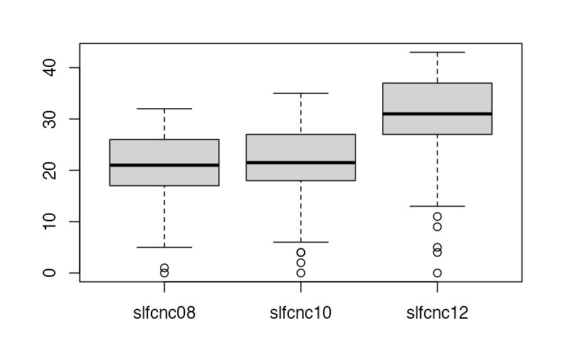

### Exercise 2.1

(NELS dataset) Create a frequency distribution table of the variable `ABSENT12`, which gives the number of times a student was absent in twelfth grade. Use the frequency distribution to answer the following questions:

a) How many students in the NELS data set were absent 3–6 times in twelfth grade?

b) How many students in the NELS data set were absent exactly 3 times in twelfth grade?

c) What percentage of students in the NELS data set was absent 3–6 times in twelfth grade?

d) What percentage of students in the NELS data set was absent 6 or fewer times in twelfth grade?

<details>
<summary>### Solution</summary>

a) 180 students.

b) It is impossible to know the exact number. Assuming equal numbers of students were absent 3, 4, 5, and 6 times, the estimate is 180 / 4 = 45 students.

c) 36%.

d) 86%.

</details>

### Exercise 2.2

(NELS dataset) Create a frequency distribution table of the variable `PARMARL8`, which gives the marital status of the parents when the student was in eighth grade. Use it and the Data View window to answer the following questions:

a) What does a score of 3 indicate on the variable `PARMARL8`?

b) For how many students in the NELS data set was `PARMARL8 = 3`?

c) For what percentage of students in the NELS data set was `PARMARL8 = 3`?

d) Why is the cumulative percent column of `PARMARL8` not meaningful?

<details>
<summary>### Solution</summary>

a) The student’s parents were separated when the student was in eighth grade.

b) 8 students.

c) Of students who reported their parents’ marital status in eighth grade, 1.7% reported that their parents were separated. (Jamovi automatically excludes missing values from the percentage calculation.)

d) `PARMARL8` is nominal, so its categories have no intrinsic ordering. The numerical codes are assigned arbitrarily, so cumulative percentages are not meaningful.

</details>


### Exercise 2.4

(NELS dataset) Create a bar plot summarizing the variable `GENDER`. Use it to answer the following questions:

a) Why is a bar graph an appropriate display in this case?

b) Are there more males or females in the NELS?

c) What percentage of students is female (you might also want to create a frequency table)?

<details>
<summary>### Solution</summary>

a) `GENDER` is a nominal variable.

b) There are more females: 273 females and 227 males.

c) 54.6%.

</details>


### Exercise 2.6

Create a bar plot for average daily school attendance rate, given by the variable `SCHATTRT` in the NELS data set. Use the bar plot to answer the following questions:

a) Why does the bar plot for `SCHATTRT` appear problematic?

b) What type of graph(s) could be selected to display `SCHATTRT` instead?

<details>
<summary>### Solution</summary>

a) The bar plot is not appropriate for `SCHATTRT` because it is a continuous variable.

b) A stem-and-leaf plot, histogram, or boxplot.

</details>

### Exercise 2.9

Provided below is a stem-and-leaf plot of the variable `MATHCOMP` from the learndis data set. Use it to answer the following questions:

```text
The decimal point is 1 digit(s) to the right of the |

   6 | 126678999

   7 | 0022233345566777777888888889

   8 | 00012244444456667789

   9 | 0112223333335566777788

  10 | 0013338

  11 | 2235678

  12 | 1
```

a) What is the lowest and highest score in the distribution?

b) How many scores are in the sixties?


<details>
<summary>### Solution</summary>

a) The lowest score is 61 and the highest score is 121.

b) There are 9 scores in the sixties.

</details>


### Exercise 2.13

Provided below is a stem-and-leaf plot of eighth-grade math achievement scores, given by the variable `ACHMAT08` in the NELS data set. Use the stem-and-leaf plot to answer the following questions:

```text
The decimal point is at the |

  36 | 6122

  38 | 4780357

  40 | 022555579934689

  42 | 0335577000133445689

  44 | 00012244467788334467778899

  46 | 34455566677888890022344456677888

  48 | 0000013366788902223444466889

  50 | 0011123566778888990000111233344455779

  52 | 111112223334455668889000022456677889

  54 | 0001122333444555577888999900000003345678899

  56 | 1122334677788889990000112233344444778

  58 | 01113334677888899999034446679

  60 | 001223334556777888000112333345689

  62 | 0001111233345558892223677777779

  64 | 01122566788999223455677889

  66 | 0001122333444667799122333456677889

  68 | 002223566668900122446779

  70 | 0114899499

  72 | 1463345788

  74 | 0223333500014

  76 | 222222
```

a) According to the stem-and-leaf plot, what is the lowest eighth-grade math achievement score?

b) According to the stem-and-leaf plot, what is the highest eighth-grade math achievement score?

b) According to the stem-and-leaf plot, how many students received the highest eighth-grade math achievement score?

<details>
<summary>### Solution</summary>

a) 36.6.

b) 76.2.

c) There are 6 students who received the highest eighth-grade math achievement score.

</details>


### Exercise 2.15

Create a histogram of twelfth-grade math achievement, given by the variable `ACHMAT12` in the NELS data set. Use the histogram to answer the following questions:

a) According to the histogram, what is the smallest twelfth-grade math achievement score in the NELS data set? 

b) According to the histogram, what is the most frequently occurring twelfth-grade math achievement score interval?

<details>
<summary>### Solution</summary>

a) Approximately 35 (or 34, or 36).

b) Around 55.

</details>

### Exercise 2.16

Create two side-by-side histograms for socioeconomic status, given by the variable `SES` in the NELS data set. Let one histogram represent students who did not own a computer in eighth grade and the other represent students who did own a computer (`COMPUTER`). To do this, put `SES` in the Variables box and put `COMPUTER` in the Split by box. Use the histograms to answer the following questions:

a) Which computer group has the single highest SES score?

b) Would you say that SES is higher for the group that owns a computer? Why or why not?

c) Do the SES values have more spread for one group than the other?

<details>
<summary>### Solution</summary>

a) The group that owned a computer in eighth grade.

b) Yes. SES appears higher for the group that owns a computer because its distribution begins and ends at higher points on the SES scale, and its scores are generally higher.

c) No. The spread of the two distributions appears quite similar.

</details>

### Exercise 2.21

Find the following values for a student’s expected income at age 30, given by the variable `EXPINC30` in the NELS data set:

a) What is the exact value of the 15th percentile? Provide an interpretation.

b) What is the exact value of the 50th percentile? Provide an interpretation.

c) What is the approximate percentile rank of an expected income of $50,000?

d) What is the approximate percentile rank of an expected income of $55,000?

<details>
<summary>### Solution</summary>

a) $25,000. This means that 15% of students expect to earn less than $25,000 at age 30.

b) $40,000. This means that 50% of students expect to earn less than $40,000 at age 30.

c) 70 percent.

d) Between 70 percent and 80 percent.

</details>


### Exercise 2.24

(NELS data set) Create a boxplot that shows the number of times a student in twelfth grade was recorded late for school, given by the variable `LATE12`. Note that the level of measurement of `LATE12` is ordinal. Use the boxplot and the scoring information in the data set to answer the following questions:

a) Estimate and interpret the value of the 50th percentile for `LATE12`, represented by the line in the middle of the box.

b) Estimate the IQR of this distribution.

d) What is the significance of the fact that the graph has no bottom whisker?

<details>
<summary>### Solution</summary>

a) The 50th percentile is 1. Since 1 means being late one or two times, half the students were late no more than one or two times.

b) The IQR is $2 - 0 = 2$.

d) The minimum score is the same as the 25th percentile. At least 25% of students were never late in twelfth grade.

</details>

### Exercise 2.25

(NELS data) Given below is a graph that has three boxplots, one for each distribution of self-concept scores for eighth, tenth, and twelfth grades, respectively. Use this graph to answer the following questions:



a) Overall, which of the three grades has the highest level of self-concept?

b) Which of the three grades contains the highest single self-concept score? What is your estimate of that score?

<details>
<summary>### Solution</summary>

a) Twelfth grade, based on the 50th percentile.

b) Twelfth grade; approximately 43.

</details>

### Exercise 2.26

Create four boxplots on the same axis, one for each `region`, that plot the number of years of math taken in high school, given by the variable `UNITMATH` in the NELS data set. Use the graph to answer the following questions:

a) In which of the four regions is the overall level of `UNITMATH` lowest?

b) Which of the four regions contains the student with the single lowest number of units of math taken in high school? What is that number?

c) How many of the 106 students in the Northeast have `UNITMATH` scores between Q1 and Q2? Is this number confined to `UNITMATH` scores, or does it generalize to all variables in this data set?

<details>
<summary>### Solution</summary>

a) West (based on the median).

b) West. There is a student in the Northeast who took only one year of math in high school.

c) Approximately $0.25 \times 106 = 27$ students. Because 25% of scores in any distribution fall between Q1 and Q2, this generalizes to all variables in the data set.

</details>


### Exercise 2.33

The following questions pertain to social economic status, given by the variable `SES` in the NELS data set:

a) What is the highest social economic status score in the NELS data set?

b) What is the most frequently occurring social economic status score in this distribution? Use a histogram to estimate.

c) What is the 50th percentile of the social economic status distribution?

d) What is the 67th percentile of the social economic status distribution?

e) What percentage of students have a social economic status score of 30 or below?

<details>
<summary>### Solution</summary>

a) 35.

b) About 18 to 20.

c) 19.

d) 22.

e) More than 90%.


</details>

### Exercise 2.34

The following questions pertain to the amount of time spent weekly on extracurricular activities in twelfth grade, given by `EXCURR12` in the NELS data set:

a) What does the value 2 represent?

b) How many students in the NELS data set answered that they spent 1–4 hours per week on extracurricular activities?

c) What is the value at the 50th percentile?

<details>
<summary>### Solution</summary>

a) A value of 2 represents spending 1–4 hours per week on extracurricular activities in twelfth grade.

b) 125 students.

c) 1–4 hours.

</details>