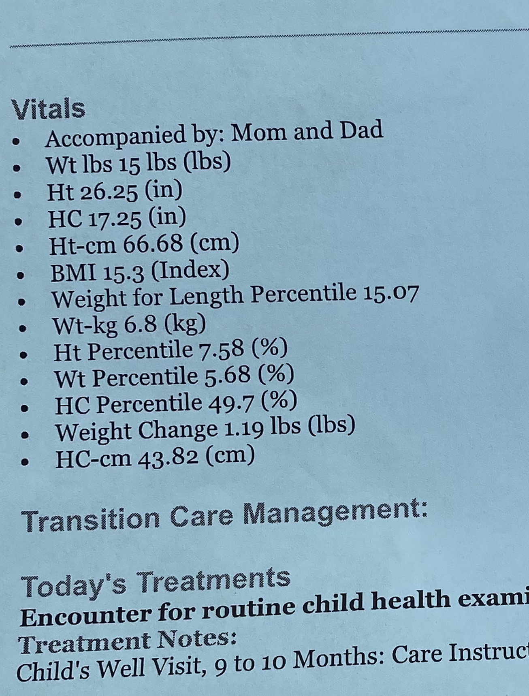

```{r setup, include = FALSE}
knitr::opts_chunk$set(fig.align='center',
                      fig.height=3,
                      fig.width=3,
                      out.width="50%",
                      echo=T)
```

## Prep work
```{r,echo=T}
library(Lock5Data)
library(tidyverse)
?NBAPlayers2024
#data("NBAPlayers2024") # optional
#data() # gives a list of available dataset
NBAPlayers2024$pointsPerGame <-
  NBAPlayers2024$Points/NBAPlayers2024$Games
```

# Univariate distribution: location, spread, and shape

## Overview

-   To describe a univariate distribution, we focus on three important properties: **location**, **spread**, and **shape**

-   Tools: statistics, tables, and visualizations

    -   A statistic is a numeric summary of data (e.g.: sample mean is a statistic; sample maximum is a statistic)

-   Important statistics:

    -   Mean, median, mode
    -   Percentiles
    -   Min, max
    -   Range and Interquartile Range (IQR)
    -   Standard deviation and variance

## Location: mean, median, mode

-   Location (also referred to as **central tendency**) is a measure of a typical/average value

-   Example: what is the mean, median, and mode for this data?

```{r,echo=T,eval=T}
sleep <- c(5,5,6,6,6,7,7,7,8,14)
```

-   For **numeric variables**, use mean and/or median
    -   Example: typically, how many hours do students sleep?
    -   Median is more **robust to outliers**
    -   When mean and median values are very different, it signals very **skewed** distribution and the existence of outliers


-   In R (note, there is no built-in function for mode):

```{r,eval=T}
summary(sleep)
mean(sleep)
median(sleep)
table(sleep) # table () gives frequency for numeric variables
summary(as.factor(sleep)) # summary() gives frequency for factor variables
# equivalent code with pipe operator
sleep |> as.factor() |> summary()
```


-   Q: how can you convert the frequency to percentages?
-   Q: how do you use R to automatically give you the mode?

<details>
<summary>Show code</summary>

```{r,echo=F}
table(sleep) %>% 
  as.data.frame() %>%
  mutate(Percent = Freq / sum(Freq)) %>%
  arrange(desc(Freq))
```

</details>


-   For **categorical variables** (i.e., factor), use mode
    -   Example: based on **mtcars**, what kind of transmission type (0=automatic,1=manual) do cars typically have?

```{r}
table(mtcars$am)
```


## Percentiles

-   The percentile (rank) of a value is the percentage **below** that value


      {width=60%}


-   The kth percentile of a variable is a value such that k percent are below that value

    -   Example: [Growth charts for children](https://www.cdc.gov/growthcharts/cdc-charts.htm){target="_blank"}
    -   Example: [SAT scores](https://en.wikipedia.org/wiki/SAT){target="_blank"}

- Special percentiles: first, second and third **quartiles** (i.e., Q1, Q2, and Q3) correspond to the 25th, 50th, and 75th percentiles; Q2 is the median

- Percentiles (especially Q1, Q2, and Q3) provide a sense of the **location** of the distribution

```{r}
summary(NBAPlayers2024$pointsPerGame)
quantile(NBAPlayers2024$pointsPerGame, c(0.95, 0.75, 0.05))
```

## Spread: range and IQR

-   Spread can be measured by range and **interquartile range** (IQR)

    -   range: min to max
    -   IQR: Q1 to Q3 (i.e., range for the middle 50% of people)

```{r}
summary(NBAPlayers2024$FG3Pct)
range(NBAPlayers2024$FG3Pct,na.rm = T)
summary(NBAPlayers2024$FGPct)
quantile(NBAPlayers2024$FGPct, c(0.25, 0.75), na.rm = T)
IQR(NBAPlayers2024$FGPct, na.rm = T)
```

-   Are NBA players more consistent in their field goal shooting ability, or in 3-point field goal shooting ability?

-   Range is very affected by outliers!


## Boxplot
Boxplot is based on **only five numbers**: min, Q1, Q2, Q3, max (also called the **five-number summary**)
    

<details>
<summary>Show code</summary>

```{r,eval=F,out.width="70%",fig.height=4,fig.width=3}
boxplot(NBAPlayers2024$FGPct,
        main=paste('Field goal percentage'),
        col='pink',
        border='royalblue',
        cex.main=0.8,range=0)

# `text()` adds text to an *existing* plot at the specified coordinate
text(1.25,quantile(NBAPlayers2024$FGPct,na.rm = T),
     labels=c('min','Q1','median','Q3','max'),
     col='royalblue',
     cex=0.7)
```

</details>


```{r,echo=F,out.width="50%",fig.height=4,fig.width=3}
boxplot(NBAPlayers2024$FGPct,
        main=paste('Field goal percentage'),
        col='pink',
        border='royalblue',
        cex.main=0.8,range=0)

text(1.25,quantile(NBAPlayers2024$FGPct,na.rm = T),
     labels=c('min','Q1','median','Q3','max'),
     col='royalblue',
     cex=0.7)
```


## Spread: standard deviation (SD) and variance

-   SD is a measure of how spread out the data points are ("average distance of each data point to the mean")
-   SD has the same unit as the data

```{r}
GPA <- c(3.2,3.3,3.4)
sd(GPA)  #small SD, consistent GPA
TEMP <- c(50,60,90,100)
mean(TEMP); sd(TEMP) #large SD, lots of variation in temp
```

-   Variance is the square of SD

```{r}
var(GPA)
```

## Shape: histogram and skewness

-   For determining the direction of skewness, look for **tail values**; extreme tail values are referred to as **outliers**

    - If tail values or extreme values are LARGE: right skewed (positive skew); e.g., income, house price, etc.
    - If tail values or extreme values are SMALL: left skewed (negative skew); e.g., age at death, retirement age, etc.

-   Histogram is a widely used **univariate** plot (in base R, use **hist()**)

-   When describing shape, pay attention to: skewness, outliers, number of modes, and any other unusual pattern in the data

```{r,echo=F,out.width="100%",fig.height=3,fig.width=9}
par(mfrow=c(1,3))
hist(rbeta(n=500,shape1 = 4,shape2 = 2),freq=F,
     cex.lab=1.5,
     cex.axis=2,
     xlab=NA,
     ylab=NA,
     main='Left skewed',
     cex.main=2,
     yaxt='n',xaxt='n',
     col='lightblue',
     border='blue',lty='dashed',
     nclass=30,
     xlim=c(0,1))
curve(dbeta(x,shape1=4,shape2=2),add=T,col='red',lwd=2)

hist(rbeta(n=500,shape1 = 2,shape2 = 5),freq=F,
     cex.lab=1.5,
     cex.axis=2,
     xlab=NA,
     ylab=NA,
     main='Right skewed',
     cex.main=2,
     yaxt='n',xaxt='n',
     col='lightblue',
     border='blue',lty='dashed',
     nclass=30,
     xlim=c(0,1))
curve(dbeta(x,shape1=2,shape2=5),add=T,col='red',lwd=2)

hist(rnorm(n=500,mean = 2,sd = 1),freq=F,
     cex.lab=1.5,
     cex.axis=2,
     xlab=NA,
     ylab=NA,
     main='Roughly symmetric',
     cex.main=2,
     yaxt='n',xaxt='n',
     col='lightblue',
     border='blue',lty='dashed',
     nclass=30,
     xlim=c(0,4))
curve(dnorm(x,mean=2,sd=1),add=T,col='red',lwd=2)
```

## Exercise 1

Give a thorough description of the variable **FGPct** (Field goal percent), using statistics and visualizations as needed. Mention properties of *location* and *spread*, and describe the *shape* of the distribution.

<details>
<summary>Show solution</summary>

The field-goal percentages based on NBA data from 2024 range from **0.372 to 0.747**. The mean is **0.478**, while the median is **0.462**, so a typical player has a field-goal percentage of about **46%**. The middle 50% of players have field-goal percentages from **0.440 to 0.498**, giving an interquartile range of **0.058**. The standard deviation is **0.062**.

The distribution is **right-skewed**: the mean is higher than the median, and the upper tail extends farther than the lower tail.

```{r, eval=T}
range(NBAPlayers2024$FGPct, na.rm = TRUE)
mean(NBAPlayers2024$FGPct, na.rm = TRUE)
median(NBAPlayers2024$FGPct, na.rm = TRUE)
quantile(NBAPlayers2024$FGPct, c(0.25, 0.75), na.rm = TRUE)
IQR(NBAPlayers2024$FGPct, na.rm = TRUE)
sd(NBAPlayers2024$FGPct, na.rm = TRUE)
hist(NBAPlayers2024$FGPct, main = "Field-goal percentage", xlab = "FGPct", col = "lightblue", border = "blue")
```

</details>


# Z-score

## Z-score

-   **Z-score** (or standardized score) of a variable is calculated as `(value - mean) / sd`

-   It's used to *standardize* a variable so that you can make sense of the value regardless of the scale or unit

-   Example: Tom has an SAT of 1400. Jerry has an ACT of 28. Who has a better score? We know that:

    -   SAT: mean=1100, sd=150
    -   ACT: mean=25, sd=2

-   Q: what's the z-score for Tom? for Jerry?
-   Q: Interpretations of the z-scores?

<details>
<summary>Show solution</summary>

Tom's z-score is $(1400 - 1100) / 150 = 2$. Jerry's z-score is $(28 - 25) / 2 = 1.5$.

Tom's SAT score is **2 standard deviations above** the SAT mean, while Jerry's ACT score is **1.5 standard deviations above** the ACT mean. Relative to their respective tests, Tom has the higher score.

</details>

in R: 

```{r,echo=T,eval=F}
# by hand: a vector is created
a <- NBAPlayers2024$FGPct
z1 <- (a - mean(a))/sd(a)

# using scale(): a matrix is created
z2 <- scale(NBAPlayers2024$FGPct)
```


## Exercise 2
1. Calculate the z-scores of **FGPct** and **FG3Pct** and store the z-scores as separate variables in the data frame.

2. Print the information for Stephen Curry and give an interpretation for the z-scores of **FGPct** and **FG3Pct**.  Relatively speaking, is he better at field goals or 3-point field goals? 

3. Find a player whose field goal percentage is above the average, but 3-point field goal percentage is below the average.

4. Find a player who is very capable in both field goal and 3-point field goal.

5. What is the mean and sd for the z-scores of **FGPct** and **FG3Pct**?

<details>
<summary>Show solution</summary>

```{r, eval=F}
NBAPlayers2024 <- NBAPlayers2024 %>%
  mutate(FGPct.z = as.numeric(scale(FGPct)),
         FG3Pct.z = as.numeric(scale(FG3Pct)))

NBAPlayers2024 %>%
  filter(Player == "Stephen Curry") %>%
  select(Player, Team, FGPct, FG3Pct, FGPct.z, FG3Pct.z)

NBAPlayers2024 %>%
  filter(FGPct.z > 0, FG3Pct.z < 0) %>%
  select(Player, Team, FGPct, FG3Pct, FGPct.z, FG3Pct.z,MinPerGame)%>%
  arrange(desc(MinPerGame))

NBAPlayers2024 %>%
  filter(FGPct.z > 1, FG3Pct.z > 1) %>%
  select(Player, Team, FGPct, FG3Pct, FGPct.z, FG3Pct.z)

summary(NBAPlayers2024$FGPct.z)
summary(NBAPlayers2024$FG3Pct.z)
```

1. Add the standardized variables with `scale()`, as shown in the code above.

2. Stephen Curry's FGPct z-score is **-0.449**, while his FG3Pct z-score is **0.768**. His field-goal percentage is about 0.449 standard deviations BELOW the sample mean, while his 3-point percentage is 0.768 standard deviations ABOVE the sample mean. Relative to other players, he is stronger at 3-point field goals.

3. **DeMar DeRozan** is one example: his FGPct is 0.038 SDs above the mean, while his FG3Pct is 0.226 SDs below the mean.

4. **Jalen Williams** is one example of a player who is very capable in both areas: his FGPct z-score is 1.012 and his FG3Pct z-score is 1.020, so both are more than one standard deviation above their respective means.

5. The mean of each z-score variable is approximately **0**, and the standard deviation is **1**; this is expected by how z-scores are calculated.

</details>


